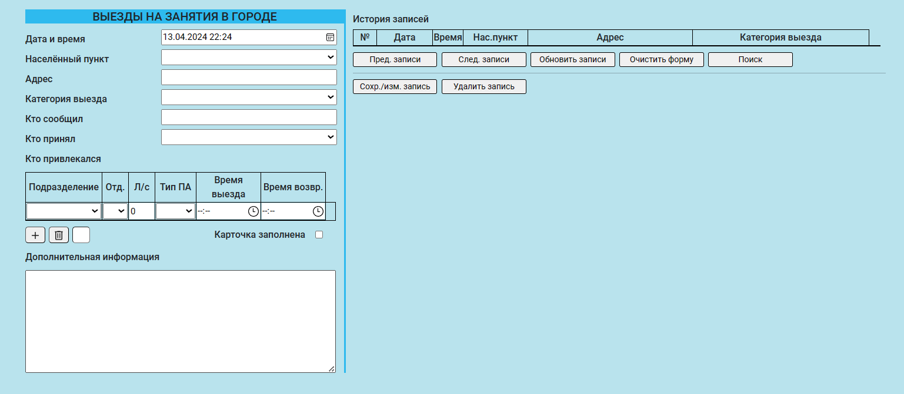

# Журнал учёта выездов подразделений пожарно-спасательного гарнизона

---
### Описание

---
Данное приложение предназначено для регистрации, хранения и последующей обработке информации о выездах подразделений всех видов, 
входящих в состав пожарно-спасательного гарнизона, и может быть использовано 
в центральных пунктах пожарной связи. Веб-интерфейс приложения очень прост и интуитивно понятен.

* ***Выезды по тревоге в городе.***

* ***Выезды на занятия в городе.***

---
### Установка

---

Для установки приложения вам потребуется установленный Docker Engine, 
после инициализируйте кластер Docker Swarm.

    docker swarm init

Вам необходимо указать своего пользователя и пароль при входе в приложение, 
а также учётные данные для соединения с базой данных:
    
    docker secret create security_user your_redentials \
    docker secret create security_pwd your_redentials \
    docker secret create mysql_user your_redentials \
    docker secret create mysql_pwd your_redentials \

Собираем образ приложения и скачиваем образ базы данных:

    docker build -t dispatch_log_app:latest . \
    docker pull mysql:oracle

Далее запускаем наш стэк с помощью docker-compose.yml:

    docker stack deploy -c .\docker-compose.yml app
    

